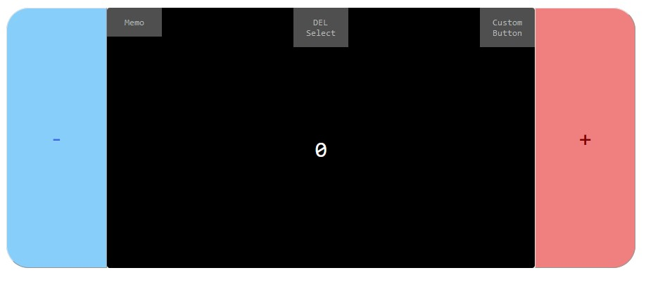

# Exercise js counter
Counter done entirely with JavaScript as a demonstration.

## Usage example
Use the +/- keys to change the digit within the screen.

### MEMO MENU
The numbers can be saved "Memo > SAVE memo" menu

To view the saved "Memo > SHOW memo"

To delete them "Memo > DELETE memo"

### CUSTOM BUTTON MENU
Buttons can be created to count with different digits.
"Custom Buttons > New Buttons"
A new menu will open underneath. Enter the desired digit and press the "Make it!" button. The default digit is the number shown on the screen when the form opens.

To show or hide the created buttons "Custom Button > SHOW keyboard"

To delete them all "Custom Button > DELETE keyboard"

### SELECT MENU
You can delete the buttons and numbers memorized according to some criteria.
You can delete all:
- POSITIVE "DEL Select > DELETE POSITIVE" buttons/memos
- NEGATIVE "DEL Select > DELETE NEGATIVE" buttons/memos
- buttons/memo with number equal to ZERO "DEL Select > DELETE ZERO"
- selected buttons/memos with right click and "Del Select > DELETE selected"

### SCROLL TRUE THE LIST
List of button and memos are scrollable

## Meta

Patrizia Busatto – [@YourTwitter](https://twitter.com/dbader_org) – YourEmail@example.com

[https://github.com/yourname/github-link](https://github.com/dbader/)