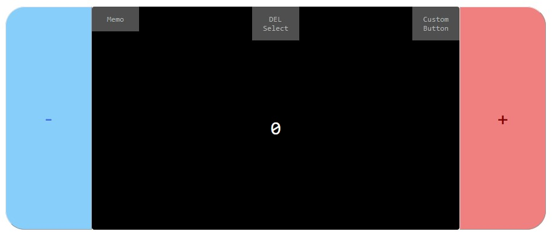
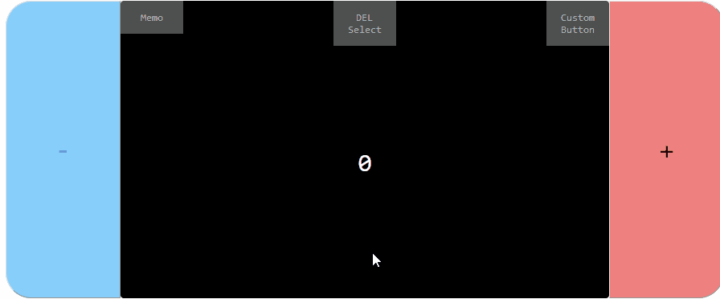
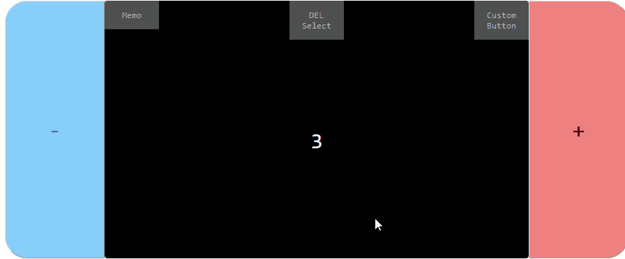
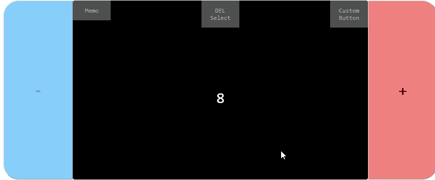
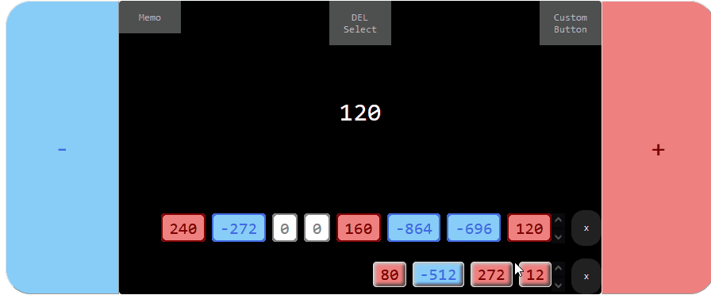
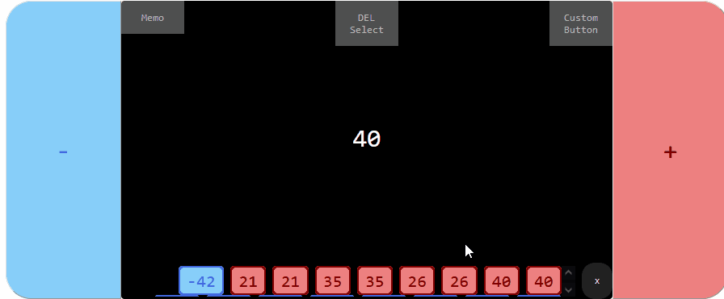

# Javascript Counter Demo
Counter done entirely with JavaScript as a demonstration.

Test it __[here](https://patribu7.github.io/counter/)__!

## Usage example
Use the +/- keys to change the digit within the screen.

### MEMO MENU
To use the memo you can:
- "Memo > SAVE memo": to save the number
- "Memo > SHOW memo": To view saved numbers 
- "Memo > DELETE memo": to delete them

### CUSTOM BUTTON MENU
- "Custom Buttons > New Buttons": buttons can be created to count with different values.
A new menu will open underneath. Enter the desired value and press the "Make it!" button. The default digit is the number shown on the screen when the form opens.
- "Custom Button > SHOW keyboard": to show or hide the created buttons 
- "Custom Button > DELETE keyboard": to delete them

### SELECT MENU
You can delete the buttons and numbers memorized according to some criteria.
You can delete all:
- POSITIVE "DEL Select > DELETE POSITIVE" buttons/memos
- NEGATIVE "DEL Select > DELETE NEGATIVE" buttons/memos
- buttons/memo with number equal to ZERO "DEL Select > DELETE ZERO"
- selected buttons/memos with right click and "Del Select > DELETE selected"

### LIST VIEW
List of buttons and memos are scrollable to get a complete overview

## My links

Patrizia Busatto – [@LinkedIn](https://www.linkedin.com/in/patrizia-busatto/)